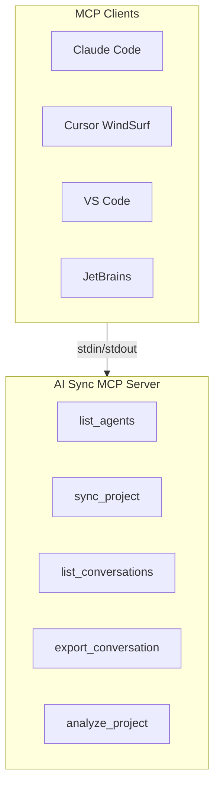
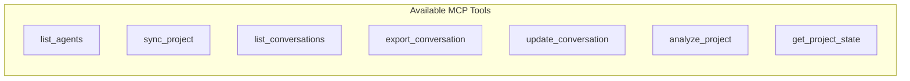

# MCP Integration Guide

AI Sync includes a full [Model Context Protocol](https://modelcontextprotocol.io/) (MCP) server for integration with AI clients and IDEs.



## Quick Start

```bash
# Install (includes MCP server)
npm install -g ai-sync-cli

# Start MCP server
npx ai-sync-mcp
```

## MCP Server

The MCP server is included in the `ai-sync-cli` package - no separate installation needed.

### Starting the Server

```bash
# Using npx (recommended)
npx ai-sync-mcp

# Using installed binary
ai-sync-mcp

# Direct node execution
node $(npm root -g)/ai-sync-cli/dist/mcp/cli.js
```

### Output

When running correctly, you should see:
```
AI Sync MCP Server running
```

The server communicates via stdio (stdin/stdout) - the standard MCP transport.

## IDE Configuration

```bash
# Install globally
npm install -g ai-sync-cli

# Verify MCP server works
echo '{"jsonrpc":"2.0","id":1,"method":"initialize","params":{"protocolVersion":"2024-11-05","capabilities":{},"clientInfo":{"name":"test","version":"1.0.0"}}}' | npx ai-sync-mcp
```

## MCP Server

### Installation

The MCP server is included with `ai-sync-cli`:

```bash
npm install -g ai-sync-cli
```

### Starting the Server

```bash
# Using npx (recommended)
npx ai-sync-mcp

# Using installed binary
ai-sync-mcp

# Direct node execution
node $(npm root -g)/ai-sync-cli/dist/mcp/cli.js
```

### Output

When running correctly, you should see:
```
AI Sync MCP Server running
```

The server communicates via stdio (stdin/stdout) - this is the standard MCP transport.

## IDE Configuration

### Visual Studio Code

VS Code supports MCP servers through the MCP extension or native configuration.

#### Method 1: Using `.vscode/mcp.json` (VS Code 1.99+)

Create or edit `.vscode/mcp.json` in your project:

```json
{
  "servers": {
    "ai-sync-cli": {
      "command": "npx",
      "args": ["ai-sync-mcp"],
      "env": {}
    }
  }
}
```

#### Method 2: Using VS Code Settings

Add to your `settings.json`:

```json
{
  "mcp.servers": {
    "ai-sync-cli": {
      "command": "npx",
      "args": ["ai-sync-mcp"]
    }
  }
}
```

#### Method 3: Using the MCP extension

1. Install the "MCP" extension by Model Context Protocol
2. Open Command Palette (`Ctrl+Shift+P`)
3. Run "MCP: Add Server"
4. Select "ai-sync-cli"

### Cursor

#### Method 1: Settings UI

1. Open Cursor Settings (`Cmd+,` on Mac, `Ctrl+,` on Windows/Linux)
2. Navigate to "MCP" or "Model Context Protocol"
3. Click "Add new MCP server"
4. Name: `ai-sync-cli`
5. Command: `npx ai-sync-mcp`

#### Method 2: Configuration File

Create or edit `~/.cursor/mcp.json` (global) or `.cursor/mcp.json` (project):

```json
{
  "mcpServers": {
    "ai-sync-cli": {
      "command": "npx",
      "args": ["ai-sync-mcp"]
    }
  }
}
```

### Claude Desktop

#### macOS

Edit `~/Library/Application Support/Claude/claude_desktop_config.json`:

```json
{
  "mcpServers": {
    "ai-sync-cli": {
      "command": "npx",
      "args": ["ai-sync-mcp"]
    }
  }
}
```

#### Windows

Edit `%APPDATA%\Claude\claude_desktop_config.json`:

```json
{
  "mcpServers": {
    "ai-sync-cli": {
      "command": "npx",
      "args": ["ai-sync-mcp"]
    }
  }
}
```

#### Linux

Edit `~/.config/Claude/claude_desktop_config.json`:

```json
{
  "mcpServers": {
    "ai-sync-cli": {
      "command": "npx",
      "args": ["ai-sync-mcp"]
    }
  }
}
```

### JetBrains IDEs

JetBrains supports MCP through the "MCP Client" plugin or settings.

#### Method 1: Settings

1. Open Settings (`Ctrl+Alt+S`)
2. Navigate to "Language & Frameworks" > "Model Context Protocol" or search for "MCP"
3. Click "Add Server"
4. Name: `ai-sync-cli`
5. Command: `npx ai-sync-mcp`

#### Method 2: Configuration File

Create `.jetbrains.json` in your project:

```json
{
  "mcpServers": {
    "ai-sync-cli": {
      "command": "npx",
      "args": ["ai-sync-mcp"]
    }
  }
}
```

### Neovim

#### Using nvim-mcp

Install `nvim-mcp` plugin, then add to your `init.lua`:

```lua
local mcp = require('mcp')
mcp.setup({
  servers = {
    agent_sync = {
      command = 'npx',
      args = { 'ai-sync-mcp' }
    }
  }
})
```

#### Using глагол/MCP.nvim

```lua
require('mcp').setup({
  servers = {
    ['ai-sync-cli'] = {
      command = 'npx',
      args = { 'ai-sync-mcp' }
    }
  }
})
```

#### Using folio/mcp.nvim

```lua
require('mcp').setup({
  servers = {
    ai-sync-cli = {
      command = 'npx',
      args = { 'ai-sync-mcp' }
    }
  }
})
```

### Emacs

#### Using lsp-mode with mcp

Install `lsp-mode` and configure:

```elisp
(require 'lsp-mode)
(require 'mcp)

(lsp-mcp-configure
 '("ai-sync-cli"
   :type "stdio"
   :command "npx"
   :args '("ai-sync-mcp")))
```

#### Using meow/mcp.el

```elisp
(require 'mcp)
(add-to-list 'mcp-servers '("ai-sync-cli" . ("npx" "ai-sync-mcp")))
```

## AI Agent Configuration

### Claude Code

Claude Code can use MCP tools. To enable ai-sync-cli:

1. Install: `npm install -g ai-sync-cli`
2. Claude Code should auto-detect MCP servers

Or manually configure in `~/.claude/settings.json`:

```json
{
  "mcpServers": {
    "ai-sync-cli": {
      "command": "npx",
      "args": ["ai-sync-mcp"]
    }
  }
}
```

### GitHub Copilot

Copilot Chat can use MCP servers with the right extension.

1. Install the "MCP Gateway" or similar extension
2. Configure in `.github/copilot/mcp.json`:

```json
{
  "servers": {
    "ai-sync-cli": {
      "command": "npx",
      "args": ["ai-sync-mcp"]
    }
  }
}
```

### Cursor

Cursor has built-in MCP support:

1. Settings > MCP > Add Server
2. Command: `npx ai-sync-mcp`

### WindSurf

WindSurf supports MCP servers:

1. Settings > MCP Servers
2. Add: `npx ai-sync-mcp`

## MCP Tools Reference



### list_agents

List all supported source agents and target IDEs.

**Parameters:**
```json
{
  "type": "all"  // "sources" | "targets" | "all"
}
```

**Example:**
```json
{
  "name": "list_agents",
  "arguments": {"type": "all"}
}
```

### sync_project

Sync a project from one agent/IDE to another.

**Parameters:**
```json
{
  "from": "claude-code",
  "to": "opencode",
  "projectPath": "./my-project",
  "overwrite": false
}
```

**Example:**
```json
{
  "name": "sync_project",
  "arguments": {
    "from": "claude-code",
    "to": "opencode",
    "projectPath": "/path/to/project",
    "overwrite": false
  }
}
```

### list_conversations

List all conversations from a source agent.

**Parameters:**
```json
{
  "agent": "claude-code",
  "projectPath": "./my-project"
}
```

### export_conversation

Export a specific conversation to a target IDE.

**Parameters:**
```json
{
  "agent": "claude-code",
  "conversationId": "session_123",
  "to": "opencode",
  "projectPath": "./my-project"
}
```

### update_conversation

Add messages to an existing conversation.

**Parameters:**
```json
{
  "agent": "claude-code",
  "conversationId": "session_123",
  "messages": [
    {"role": "user", "content": "Hello"},
    {"role": "assistant", "content": "Hi!"}
  ],
  "projectPath": "./my-project"
}
```

### analyze_project

Analyze a project and return its structure.

**Parameters:**
```json
{
  "agent": "claude-code",
  "projectPath": "./my-project"
}
```

### get_project_state

Get the current sync state of a project.

**Parameters:**
```json
{
  "projectPath": "./my-project",
  "target": "opencode"
}
```

## Testing

### Test MCP Connection

```bash
# Initialize and list tools
echo '{"jsonrpc":"2.0","id":1,"method":"initialize","params":{"protocolVersion":"2024-11-05","capabilities":{},"clientInfo":{"name":"test","version":"1.0.0"}}}' | npx ai-sync-mcp

# Response should include:
# {"jsonrpc":"2.0","id":1,"result":{"protocolVersion":"2024-11-05",...}}
```

### Test list_agents Tool

```bash
echo '{"jsonrpc":"2.0","id":2,"method":"tools/call","params":{"name":"list_agents","arguments":{}}}' | npx ai-sync-mcp
```

### Test sync_project Tool

```bash
echo '{"jsonrpc":"2.0","id":3,"method":"tools/call","params":{"name":"sync_project","arguments":{"from":"claude-code","to":"opencode","projectPath":".","overwrite":false}}}' | npx ai-sync-mcp
```

## Troubleshooting

### Server Not Starting

```bash
# Verify installation
npm list -g ai-sync-cli

# Verify dependencies
npm install
npm run build
```

### Tools Not Appearing

1. Check server is running: `ps aux | grep ai-sync-cli`
2. Restart the server
3. Check IDE MCP settings

### Connection Issues

```bash
# Check if MCP server responds
timeout 5 npx ai-sync-mcp

# Check Node.js version (requires 18+)
node --version
```

### Permission Denied (Linux/macOS)

```bash
# Fix npm permissions
sudo npm install -g ai-sync-cli

# Or use Node version manager
nvm install 18
nvm use 18
```

### Windows Path Issues

If `npx` is not found, ensure npm is in your PATH:

```powershell
# Add to PowerShell profile
$env:Path += ";$((npm prefix -g).Replace('/npm',''))\bin"
```