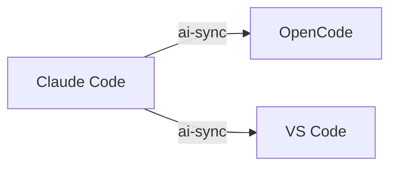
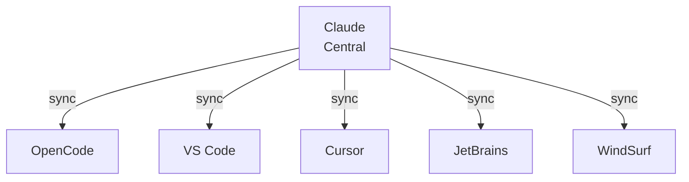
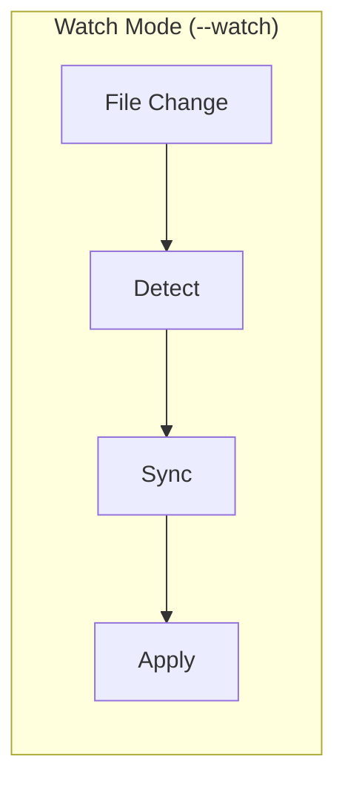

# Usage Guide

## Basic Usage

### Sync Project

Sync a project from one agent to another IDE (no sync subcommand needed):

```bash
ai-sync --from claude --to opencode --path ./my-project
```

## Command Options

| Flag | Short | Description | Default |
|------|-------|-------------|---------|
| `--from` | `-f` | Source agent | Required |
| `--to` | `-t` | Target IDE | Required |
| `--path` | `-p` | Project path | Current directory |
| `--overwrite` | `-o` | Overwrite existing config | `false` |
| `--watch` | `-w` | Watch mode | `false` |
| `--central` | | Central agent as source | |
| `--global` | | Use global config | |
| `--dry-run` | | Preview without applying | `false` |
| `--profile` | | Profile name | |
| `--json` | `-j` | JSON output | `false` |

## Commands

### init

Initialize `.agents/agentsync.toml` in current directory:

```bash
ai-sync init
ai-sync init --tools claude,opencode,copilot
```

### sync (direct)

Sync with flags (no sync subcommand required):

```bash
ai-sync --from claude --to opencode --path ./my-project
ai-sync -f claude -t opencode -p ./my-project
ai-sync --dry-run
ai-sync --central claude
ai-sync --profile frontend
ai-sync --tool vscode
```

### doctor

Run diagnostics to check configuration:

```bash
ai-sync doctor
ai-sync doctor --json
```

### clean

Remove synced files:

```bash
ai-sync clean
ai-sync clean --dry-run
```

### config

Manage configuration:

```bash
ai-sync config ls
ai-sync config ls mcp
ai-sync config add tool claude
ai-sync config add mcp github --mcp-config '{"command":"npx","args":["-y","@modelcontextprotocol/server-github"]}'
ai-sync config rm tool opencode
ai-sync config show
```

### list

List supported tools and agents:

```bash
ai-sync list tools
ai-sync list agents
```

## Visual Flows

### Basic Sync Flow



### Central Mode Flow



### Watch Mode Flow



## Examples

### Claude to OpenCode

```bash
ai-sync --from claude --to opencode --path ~/projects/my-app
```

### Copilot to VS Code

```bash
ai-sync -f copilot -t vscode -p ~/projects/my-app
```

### Central Mode (Claude to All)

```bash
ai-sync --central claude
```

### Profile-Based Sync

```bash
ai-sync --profile development
```

### Watch Mode

Watch for file changes and sync automatically:

```bash
ai-sync --from claude --to opencode --path ./project --watch
```

Press `Ctrl+C` to stop watching.

## Output Directories

Each target creates its own configuration directory:

| Target | Directory | Notes |
|--------|-----------|-------|
| Claude | `.claude/` | Skills, commands, MCP |
| OpenCode | `.agents/` | Native reader |
| VS Code | `.vscode/` | Settings |
| JetBrains | `.jetbrains/` | Workspace state |
| Cursor | `.cursor/` | Config, sessions |
| WindSurf | `.windsurf/` | Skills, commands |

## Exit Codes

- `0` - Success
- `1` - Error (missing arguments, invalid source/target, etc.)

## Environment Variables

| Variable | Description |
|----------|-------------|
| `AGENTSYNC_PROFILE` | Profile to use (e.g., `development`, `production`) |

## TOML Configuration

Create `.agents/agentsync.toml`:

```toml
tools = ["claude", "opencode", "copilot"]

[mcp.github]
command = "npx"
args = ["-y", "@modelcontextprotocol/server-github"]

[profiles.development]
tools = ["claude", "opencode"]
mcp = ["github"]

[profiles.production]
tools = ["claude"]
mcp = ["github", "postgres"]
```
